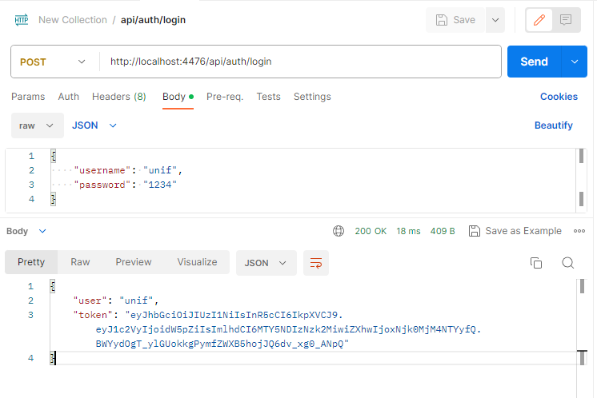
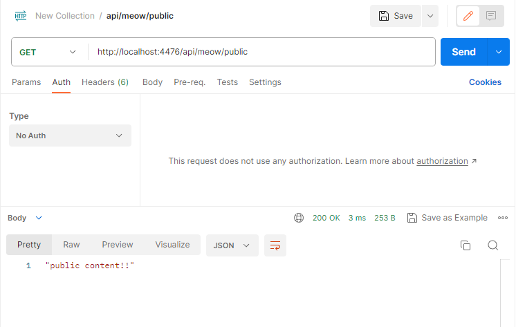
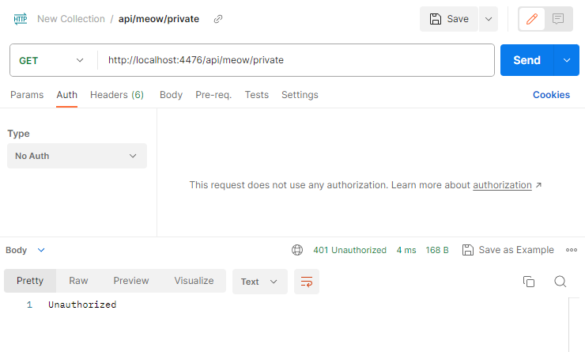
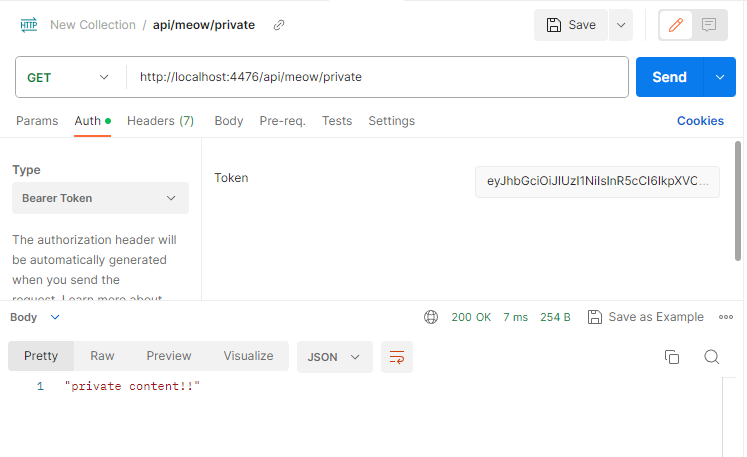

# Authentication with Jwt
```
Breif: Jwt or Json-Web-Token for autheticate that registered from a certain server.
```

## Tech Stack

**Client:** Postman

**Server:** Node, Express


## Screenshots
#### auth-login

#### public-no-auth

#### private-no-auth

#### private-with-token-auth
